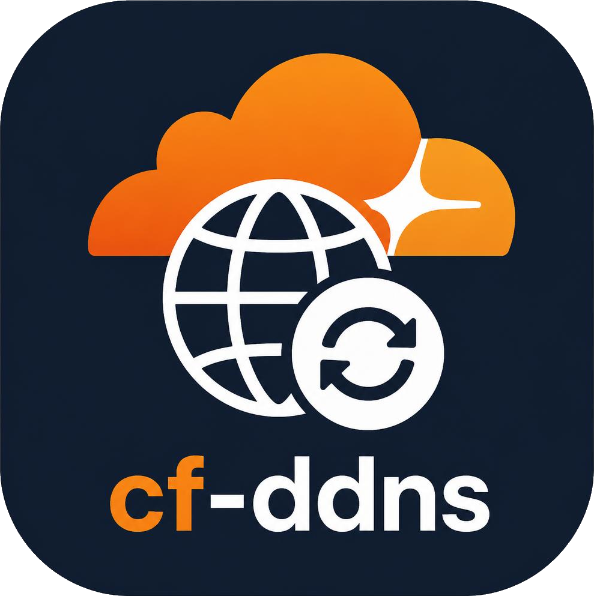

# cf-ddns

Keep Cloudflare DNS records pointed at your current public IP address.



This is a dynamic DNS client for Cloudflare.
It runs as a background service, checks your public IP on an interval, and updates the records you list when the address changes.
It is a single static binary with no runtime dependencies, and the same source builds for Windows, Linux, macOS and FreeBSD on both amd64 and arm64.

## Install on Linux

```sh
curl -fsSL https://raw.githubusercontent.com/chriswirz/cf-ddns/main/install.sh | sh
```

To install the background service at the same time, pass `--service`:

```sh
curl -fsSL https://raw.githubusercontent.com/chriswirz/cf-ddns/main/install.sh | sh -s -- --service
```

**Where things go.** Run it as root for a system install, or as an ordinary user for a per-user one.
Both work, and the script picks the right paths for whoever runs it:

| | as root | as a user |
| --- | --- | --- |
| Binary | `/usr/local/bin/cf-ddns` | `~/.local/bin/cf-ddns` |
| Config | `/etc/cf-ddns/config.json` | `~/.config/cf-ddns/config.json` |
| Service | systemd system unit | systemd user unit |

The installer verifies the release checksum, writes a starter `config.json` if there is not one already (and never overwrites an existing one), and installs the binary atomically so a running service is never left with a half-written file.

Options, which go after `sh -s --` when piping:

| Option | Effect |
| --- | --- |
| `--service` | also install and start the background service |
| `--no-service` | never install the service (the default when piped) |
| `--verbose` | run the installed service with `--verbose`, so every check is logged |
| `--version VERSION` | install a specific tag rather than the latest release |
| `--bin-dir DIR` | override where the binary goes |
| `--config-dir DIR` | override where `config.json` goes |
| `--uninstall` | remove the binary, service and unit file (your config is kept) |
| `--help` | show the full help |

The service is opt-in when piping, because a pipe has no terminal to ask on.
Run the script from a file instead and it asks.
It also declines to *start* a service whose config still has an empty `api_token`, since that would only log the same error every 30 seconds; it enables the unit and tells you the one command to run once you have filled the config in.

For macOS, Windows and FreeBSD, take a build from the [releases page](https://github.com/chriswirz/cf-ddns/releases) and see [Running as a service](#running-as-a-service).

## Quick start

1. Create a Cloudflare API token at https://dash.cloudflare.com/profile/api-tokens.
   It needs `Zone:Read` and `DNS:Edit` on the zones you want to update.
   The "Edit zone DNS" template is exactly right.

2. Build the binary, or drop in a release build.

   ```
   ./build.sh          # Linux, macOS, FreeBSD
   .\build.cmd         # Windows
   ```

3. Copy `config.example.json` to `config.json` next to the binary and edit it.
   If you are not sure what to put in `records`, leave it empty and run `cf-ddns discover`.
   It fills in a `possible_records` section listing everything your token can see.

4. Test it once before installing the service.

   ```
   cf-ddns once -v
   ```

5. Install it as a service for your platform, as described below.

## Configuration

The config file is JSON.
`cf-ddns example-config` prints a starter file.
Keys beginning with `//` are comments and are ignored.

```json
{
  "api_token": "",
  "interval_seconds": 300,
  "log_file": "cf-ddns.log",
  "records": [
    { "name": "home.example.com" },
    { "name": "vpn.example.com", "ttl": 60 },
    { "name": "www.example.com", "proxied": true },
    { "name": "home.example.com", "type": "AAAA", "create": true }
  ]
}
```

Top-level keys:

| Key | Default | Meaning |
| --- | --- | --- |
| `api_token` | none | Cloudflare API token. Overridden by the `CF_API_TOKEN` environment variable, which is the better place for it. |
| `interval_seconds` | `300` | How often to check the public IP and update the records. Values below 30 are raised to 30. |
| `log_file` | none | Also append logs to this file. Output still goes to the console. A relative path resolves next to the config file. |
| `verbose` | `false` | Log every check, not just changes. Same as passing `--verbose`. |
| `records` | required | The records to keep updated. Leave it empty to have `possible_records` filled in for you. |
| `possible_records` | written by the tool | Records discovered in your account. Not read by the updater. |

### Discovering your records

If `records` is empty, cf-ddns does not fail and it does not idle.
It lists every zone the token can see, lists the `A` and `AAAA` records in each, and writes them back to the config file as a `possible_records` section.
`cf-ddns discover` does the same thing on demand, which is how you refresh the list after adding records in the dashboard.

Starting from this:

```json
{
  "api_token": "",
  "records": []
}
```

a run produces this:

```json
{
  "api_token": "",
  "records": [],
  "// possible_records": "Discovered because \"records\" was empty. Move the entries you want kept up to date into \"records\" and re-run. Only the zone, name, type, ttl and proxied fields are used.",
  "possible_records": [
    {
      "zone": "example.com",
      "name": "home.example.com",
      "type": "A",
      "ttl": 300,
      "proxied": false,
      "content": "198.51.100.1",
      "comment": "the NAS"
    }
  ]
}
```

Move the entries you want into `records` and run again.
An entry needs no editing: the first five fields are exactly a `records` entry, and `content` and `comment` are context that the updater ignores.

The rewrite preserves the rest of the file, including its key order and any `"// ..."` comment keys, and it is written to a temporary file and renamed into place so an interrupted run cannot leave a truncated config behind.
Listing uses `GET /zones/{zone_id}/dns_records` and follows pagination, so a zone with more than 100 records is listed in full.

Per-record keys:

| Key | Default | Meaning |
| --- | --- | --- |
| `name` | required | The full record name, for example `home.example.com`. |
| `zone` | last two labels of `name` | The zone name. Set this explicitly for multi-part suffixes such as `example.co.uk`. |
| `type` | `A` | `A` for IPv4 or `AAAA` for IPv6. See below. |
| `ttl` | `1` | TTL in seconds. `1` means automatic. |
| `proxied` | `false` | Whether Cloudflare proxies the record (the orange cloud). |
| `create` | `false` | Create the record if the zone does not already have one. |

By default the config file is looked for next to the binary, then in the per-user config directory (`%APPDATA%\cf-ddns` or `~/.config/cf-ddns`), then `/etc/cf-ddns` on Unix.
Pass `--config PATH` to override.

## Verbose output

`--verbose` (or `-v`, or `"verbose": true` in the config) logs every check rather than only the changes.

```
$ cf-ddns once --verbose
2026-09-03 12:19:13 DBG config loaded from /etc/cf-ddns/config.json
2026-09-03 12:19:13 DBG IPv4 records: home.example.com, vpn.example.com
2026-09-03 12:19:13 DBG checking public IPv4 for 2 record(s)
2026-09-03 12:19:13 INF public IPv4 is 203.0.113.9
2026-09-03 12:19:13 DBG looking up A home.example.com in zone example.com (abc123)
2026-09-03 12:19:13 INF updated A home.example.com: 198.51.100.1 -> 203.0.113.9
2026-09-03 12:19:13 DBG A vpn.example.com already 203.0.113.9
```

Normal output goes to stdout and errors go to stderr, so `cf-ddns --verbose > cf-ddns.log` keeps a record of the actions while errors stay visible on the terminal.

Setting `log_file` appends to that file **in addition to** the console, not instead of it, so a log file can never leave a run with nothing on screen.
The one place that costs anything is systemd, where each line would land in both the journal and the file, so leave `log_file` unset there and use `journalctl -u cf-ddns`.

## IPv6

Set `"type": "AAAA"` on a record to keep it pointed at your public IPv6 address.
To keep both, list the name twice:

```json
"records": [
  { "name": "home.example.com", "type": "A" },
  { "name": "home.example.com", "type": "AAAA" }
]
```

The two families are handled independently.
Each has its own HTTP client pinned to `tcp4` or `tcp6`, so an `A` record can only ever be given a v4 address and an `AAAA` record a v6 one, even on a dual-stack machine where a name resolves to both.
Each also has its own provider list, because the address family is forced at dial time: a v6 lookup can only work against a provider whose own hostname has an `AAAA` record, so `api.ipify.org` and the other v4-only hosts are not in the v6 list.

Addresses are compared by value rather than as text.
This matters for IPv6, where one address has many spellings: `2001:db8::1` and `2001:0db8:0000:0000:0000:0000:0000:0001` are the same address, and a string comparison would see a change on every tick and rewrite the record forever.

If a host has no IPv6 route, the v6 check fails with a single clear line rather than a wall of per-provider errors, and it is reported once rather than on every tick:

```
FATAL no connectivity for this address family: could not reach any of the 4 IPv6
providers, so this host has no IPv6 route (run with --verbose for the
per-provider detail)
```

A v4-only network is a standing condition, not news.
Records of the other family keep updating normally throughout.

## Editing the config while it runs

The config file is re-read before every cycle, so changes apply without a restart.
Adding or removing records, rotating the API token, changing the interval and turning `verbose` on or off all take effect on the next check.

If the file cannot be re-read, the running configuration is kept and the service carries on updating.
That is the point rather than a fallback: the likeliest reason a read fails is that the file is midway through being saved, and a half-written config must never be able to stop DNS being updated.
The failure is reported once rather than on every cycle, and recovery is reported too:

```
ERR re-reading /etc/cf-ddns/config.json failed, carrying on with the config
    already loaded: unexpected end of JSON input
INF /etc/cf-ddns/config.json is readable again
INF records changed: now 1 record(s)
INF check interval changed to 45s
```

Two details follow from that:

- An empty `records` list is treated as a file caught mid-edit, not as an instruction to stop.
  It means "go and discover" at startup, but partway through a run the previous records are kept, because quietly ceasing to update DNS is the worst available outcome.
  Use `cf-ddns discover` if that is what you actually wanted.
- Changing `log_file` needs a restart, and says so. The handle is opened once at startup.

## Commands

```
cf-ddns [--config PATH] [--verbose]
                                 run continuously (service mode)
cf-ddns once [--config PATH]     update once and exit
cf-ddns discover [--config PATH] write every A/AAAA record the token can see
                                 to the config's "possible_records" section
cf-ddns example-config           print a starter config.json
cf-ddns about                    version, build details and the repo link
cf-ddns version                  just the version, for scripts
```

`about` reports what a bug report needs:

```
$ cf-ddns about
cf-ddns v0.1.0
  commit:   a1b2c3d
  built:    2026-09-03T19:19:57Z
  platform: linux/amd64 (go1.25.5)
  repo:     https://github.com/chriswirz/cf-ddns
```

The version, commit and build date are stamped in at link time by `build.sh`, `build.ps1`, the `Makefile` and the release pipeline, so a release binary reports the tag it was cut from.
A binary built with a plain `go build` or `go install` has no such stamp, so it falls back to the module version and VCS revision the Go toolchain records in the build info.

With an empty `records` list, every mode runs discovery instead of the update loop.

## Running as a service

### Linux (systemd)

The [installer](#install-on-linux) does all of this for you with `--service`.
To do it by hand:

```
sudo useradd --system --no-create-home --shell /usr/sbin/nologin cf-ddns
sudo install -m 0755 cf-ddns /usr/bin/cf-ddns
sudo install -d -m 0750 -o cf-ddns -g cf-ddns /etc/cf-ddns
sudo install -m 0640 -o root -g cf-ddns config.json /etc/cf-ddns/config.json
sudo install -m 0640 -o root -g cf-ddns packaging/cf-ddns.env /etc/cf-ddns/cf-ddns.env
sudo install -m 0644 packaging/cf-ddns.service /etc/systemd/system/cf-ddns.service
sudo systemctl daemon-reload
sudo systemctl enable --now cf-ddns
journalctl -u cf-ddns -f
```

Put the token in `/etc/cf-ddns/cf-ddns.env` as `CF_API_TOKEN=...` and leave `api_token` empty in the config file.

### macOS (launchd)

```
sudo install -m 0755 cf-ddns /usr/local/bin/cf-ddns
sudo mkdir -p /usr/local/etc/cf-ddns
sudo install -m 0600 config.json /usr/local/etc/cf-ddns/config.json
sudo install -m 0644 packaging/com.github.chriswirz.cf-ddns.plist /Library/LaunchDaemons/
sudo launchctl load -w /Library/LaunchDaemons/com.github.chriswirz.cf-ddns.plist
```

### Windows

From an elevated PowerShell prompt:

```
.\packaging\install-service.ps1 -ExePath C:\cf-ddns\cf-ddns.exe -ConfigPath C:\cf-ddns\config.json
```

That registers a scheduled task that starts at boot, runs as SYSTEM, and restarts if it exits.
Remove it with `.\packaging\install-service.ps1 -Uninstall`.
If you would rather have a real service entry in `services.msc`, wrap the same binary with NSSM or WinSW.

Note that a task running as SYSTEM does not see your user's environment variables, so on Windows either put the token in the config file (with an ACL that restricts it) or set `CF_API_TOKEN` as a machine-wide environment variable.

### Docker

There is no published image: cf-ddns is one static binary, so it is usually less trouble to drop it into a container you already run than to add another one alongside.

[`examples/docker-compose.yml`](examples/docker-compose.yml) is a worked example of that, putting cf-ddns into an nginx container.
The pairing is a natural one, because a web server on a dynamic address is only reachable while its DNS record is current, so neither half is much use without the other.

```sh
cd examples
cp .env.example .env      # set CF_API_TOKEN and CF_DDNS_RECORDS
docker compose up -d
```

The build downloads the unversioned binary from the release (`cf-ddns-linux-amd64`, or `-arm64` on a Pi or Graviton) rather than compiling anything, so the image gains a few megabytes and no toolchain.

Everything is driven from the environment, so the compose file needs no editing:

| Variable | Meaning |
| --- | --- |
| `CF_API_TOKEN` | the API token, read straight from the environment so it is never written to disk |
| `CF_DDNS_RECORDS` | comma separated record names; empty means "list what the token can see" |
| `CF_DDNS_TYPE` | `A` or `AAAA` |
| `CF_DDNS_PROXIED` | whether Cloudflare proxies the record |
| `CF_DDNS_INTERVAL` | seconds between checks |
| `CF_DDNS_VERBOSE` | `true` to log every check |
| `CF_DDNS_RELEASE` | a release tag, or `latest` |

Three things in that example are worth copying if you adapt it:

- **`config.json` is on a volume, not in the image, and it is not read-only.** cf-ddns writes to its config: with an empty `records` list it fills in a `possible_records` section listing everything the token can see. A read-only mount turns that into a failure. The file is generated from the environment on first start and then left alone, so an edit inside the volume survives a restart.
- **Either process dying takes the container down.** The entrypoint watches both and exits non-zero when one stops, which lets `restart: unless-stopped` bring up a clean pair rather than leaving a web server serving a stale address, or an updater with nothing to serve.
- **The health check covers both halves**, requiring nginx to answer on an internal port and the updater to still be running. A check that only looked at nginx would call the container healthy with the DNS record hours out of date.

To put cf-ddns in a container of your own instead, the whole of it is two lines:

```dockerfile
ADD --chmod=755 https://github.com/chriswirz/cf-ddns/releases/latest/download/cf-ddns-linux-amd64 /usr/local/bin/cf-ddns
# then run it alongside whatever the container is for, with CF_API_TOKEN set
```

A container normally has no IPv6 route, so `AAAA` records need IPv6 enabled on the daemon and on the network. Without it, cf-ddns says so once rather than on every tick, and carries on updating the `A` records.

## How it works

Each tick the updater asks a public IP echo service for the current address, trying four in turn so one provider being down does not stall it.

When the address matches what was last confirmed at Cloudflare, nothing is sent.
Otherwise the zone id and record id are looked up and the record is updated with `PATCH /zones/{zone_id}/dns_records/{record_id}`.
Zone ids are cached for the life of the process.
Any failure clears the cached address so the next tick re-checks rather than trusting a value that was never written.

Errors are logged and retried on the next tick.
The service does not exit on a network failure, since the usual cause is a link that is briefly down.

## Development

```
./build.sh --test        # gofmt, go vet, go test, and golangci-lint if installed
./build.sh --all         # cross-compile every release target into dist/
make test
make lint
```

The linter is the one CI runs. Install the pinned version with:

```
go install github.com/golangci/golangci-lint/v2/cmd/golangci-lint@v2.12
```

The code has no third-party dependencies, only the Go standard library.

There is one test that reaches the real network, kept behind a build tag so it never runs in CI:

```
go test -tags live -run TestLive -v ./internal/publicip
```

## CI and releases

GitHub Actions workflows live in `.github/workflows`:

| Workflow | Trigger | What it does |
| --- | --- | --- |
| `ci.yml` | push, pull request | gofmt, vet, build and test on Linux, macOS and Windows, golangci-lint, a cross-compile of every release target, and on a green push to `main` the tag and release |
| `dependency-review.yml` | pull request | flags risky dependency changes, skipped while the repository is private |
| `release.yml` | a `v*` tag, or called by `ci.yml` | GoReleaser builds the archives and checksums, then a second job builds `.deb` and `.rpm` packages and attaches them to the release |

A release carries two sets of downloads, and both names are load-bearing:

- `cf-ddns_<version>_<os>_<arch>.tar.gz` (and `.zip` for Windows), with the README, licence, example config and packaging files. This is what `install.sh` fetches, along with `checksums.txt`.
- `cf-ddns-<os>-<arch>`, the bare binary under a name that does not change between releases. `releases/latest/download/<name>` can only resolve if the name has no version in it, which is what a Dockerfile or a one-line `ADD` needs.

Dependency review is free on a public repository but needs GitHub Advanced Security on a private one, so that job skips itself while this repository is private rather than failing on every push.
It starts running on its own once the repository is public; nothing needs changing here.

### Versioning and releases

Every push to `main` that passes the whole of `ci.yml` is released automatically.
The tag is `v0.1.<build>`, where the build number is the CI run number padded to four digits: `v0.1.0001`, `v0.1.0042`, `v0.1.1000`.
The binary reports the same version, without the `v` that by convention only the tag carries:

```
$ cf-ddns version
cf-ddns 0.1.0042
```

The tag, the binary, and the `.deb` and `.rpm` packages all carry the same `0.1.0042`.

Build numbers stay in order but have gaps, because the run number counts pull request runs as well.
Nothing releases from a pull request, and nothing releases from a branch other than the default one.

A tag pushed by hand still releases, which is the way to cut one off the normal path:

```
git tag -a v0.1.9000 -m "cf-ddns v0.1.9000"
git push origin v0.1.9000
```

Both routes run the same `release.yml`.
The automated one calls it directly rather than relying on the tag trigger, because a tag pushed with `GITHUB_TOKEN` deliberately does not start another workflow.

That produces tar.gz archives for Linux, macOS and FreeBSD, zips for Windows, `amd64`, `arm64` and 32-bit `arm` builds, a `checksums.txt`, and `.deb` and `.rpm` packages that install the binary, the systemd unit and a starter config.

## Layout

```
install.sh           one-line installer for Linux
examples/            docker compose example: nginx with cf-ddns alongside
cmd/cf-ddns/         command line entry point
internal/config/     config file loading and validation
internal/publicip/   public IP discovery
internal/cloudflare/ minimal Cloudflare API client
internal/updater/    the check-and-update loop and the discovery pass
internal/xlog/       tiny leveled logger
packaging/           systemd unit, launchd plist, Windows task installer
```

## License

MIT. See LICENSE.
